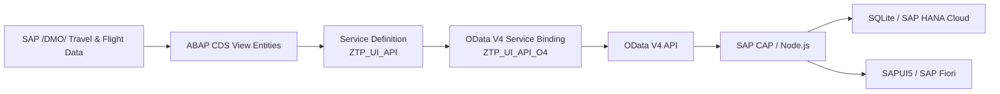

# SAP BTP Travel Expense Intelligence – ABAP Backend

ABAP Cloud integration layer for **SAP BTP Travel Expense Intelligence**, an end-to-end SAP portfolio project that combines ABAP Cloud, OData V4, SAP CAP, SAPUI5 / SAP Fiori, local development with SQLite, and cloud persistence with SAP HANA Cloud.

This repository contains the SAP BTP ABAP artifacts used to expose SAP `/DMO/` travel and flight data through an **OData V4 service**.

The main **SAP BTP Travel Expense Intelligence** application consumes this service to bring SAP travel data into the CAP layer, persist it locally for development, match uploaded travel receipts with SAP booking data, validate travel information, and perform flight cost-efficiency analysis.

> **Status:** Work in progress.  
> This repository is being reconstructed and version-controlled so the ABAP artifacts remain available independently of temporary SAP BTP trial subscriptions.

---

## Architecture



---

## Purpose

The ABAP backend provides a stable OData interface over SAP's `/DMO/` flight and travel reference data.

The **SAP BTP Travel Expense Intelligence** application uses this data to:

- match uploaded travel receipts with SAP travel and booking records;
- validate travel, booking, and flight information;
- compare booked flight prices with alternative flights;
- calculate benchmark, cheapest, and reference prices;
- assess flight cost efficiency;
- support local development with imported SAP data;
- provide a reusable ABAP-to-CAP integration layer.

---

## ABAP Artifacts

### CDS View Entities

The project exposes the required `/DMO/` data through custom CDS view entities:

- `ZTP_I_FLIGHTS`
- `ZTP_I_AGENCIES`
- `ZTP_I_CUSTOMERS`
- `ZTP_I_CONNECTIONS`
- `ZTP_I_AIRPORTS`
- `ZTP_I_BOOKINGS`
- `ZTP_I_TRAVELS`

These CDS views provide the data contract required by the CAP application.

### Service Definition

```text
ZTP_UI_API
```

The service definition exposes the CDS entities with the following OData entity-set names:

| OData Entity Set | CDS View Entity |
|---------------|----------------------|
| `Flights`     | `ZTP_I_FLIGHTS`      |
| `Agencies`    | `ZTP_I_AGENCIES`     |
| `Customers`   | `ZTP_I_CUSTOMERS`    |
| `Connections` | `ZTP_I_CONNECTIONS`  |
| `Airports`    | `ZTP_I_AIRPORTS`     |
| `Bookings`    | `ZTP_I_BOOKINGS`     |
| `Travels`     | `ZTP_I_TRAVELS`      |

### Service Binding

```text
ZTP_UI_API_O4
```

Protocol:

```text
OData V4
```

Typical service URL pattern:

```text
https://<abap-system-host>/sap/opu/odata4/sap/ztp_ui_api_o4/srvd/sap/ztp_ui_api/0001/
```

Example request:

```text
.../Flights?$top=100&sap-client=100
```

---

## Technology Stack

### ABAP Backend

- SAP BTP ABAP Environment
- ABAP Development Tools for Eclipse
- ABAP CDS View Entities
- RAP Business Services
- OData V4
- SAP `/DMO/` Flight Reference Scenario
- Git / GitHub

### Main SAP BTP Travel Expense Intelligence Application

- SAP CAP
- Node.js
- SAPUI5 / SAP Fiori with XML Fragments
- SQLite for local development
- SAP HANA Cloud for cloud deployment

---

## Development Flow

```text
SAP /DMO/ data
      ↓
ABAP CDS View Entities
      ↓
Service Definition: ZTP_UI_API
      ↓
Service Binding: ZTP_UI_API_O4
      ↓
OData V4 API
      ↓
SAP CAP / Node.js
      ↓
SQLite locally / SAP HANA Cloud on BTP
      ↓
SAPUI5 / SAP Fiori application
```

---

## Recreating the Backend in ADT

### 1. Create the ABAP package

Example package:

```text
ZTP_EXPENSE_COPILOT
```

### 2. Create the CDS view entities

Create and activate the seven `ZTP_I_*` Data Definition objects.

Use ADT Data Preview to verify that the CDS views return the expected `/DMO/` data.

### 3. Create the Service Definition

Create:

```text
ZTP_UI_API
```

Expose the seven CDS view entities through this service definition.

### 4. Create the OData V4 Service Binding

Create:

```text
ZTP_UI_API_O4
```

and assign it to:

```text
ZTP_UI_API
```

Activate and publish the service binding.

### 5. Verify the OData service

Open:

```text
.../0001/$metadata?sap-client=100
```

Verify that all seven entity sets are available:

```text
Flights
Agencies
Customers
Connections
Airports
Bookings
Travels
```

### 6. Consume the service in SAP CAP

The generated OData metadata can be stored in the CAP project and imported as an external service definition.

The CAP application can then retrieve the `/DMO/` data and persist it locally for development and analytics.

---

## Main Application Repository

The complete end-to-end solution is presented in the portfolio as:

**SAP BTP Travel Expense Intelligence**

Local CAP project directory:

```text
expense-copilot-cap
```

Main GitHub repository:

```text
expense-copilot
```

ABAP GitHub repository:

```text
expense-copilot-abap
```

The `expense-copilot` repository contains the CAP, Node.js, SAPUI5 / SAP Fiori, database, receipt-processing, validation, and analytics layers.

This `expense-copilot-abap` repository focuses on the **ABAP Cloud and OData V4 provider layer**.

---

## Why This Repository Exists

The first version of this project was developed in an SAP BTP trial ABAP environment.

Because trial environments are temporary, storing the ABAP implementation only inside the trial system creates a risk that CDS views, service definitions, and service bindings are lost when the subscription expires.

This repository therefore serves two purposes:

1. preserve the ABAP development artifacts in Git;
2. document the ABAP-to-CAP integration as part of the portfolio project.

---

## Portfolio Focus

This project demonstrates practical knowledge across multiple SAP development layers:

- modeling SAP data with ABAP CDS;
- exposing CDS entities through RAP business services;
- publishing an OData V4 API;
- consuming ABAP services from SAP CAP;
- developing backend logic with Node.js;
- working with SQLite during local development;
- deploying with SAP HANA Cloud;
- building SAPUI5 / SAP Fiori interfaces with XML Fragments;
- integrating travel, receipt, booking, and flight data;
- implementing business-oriented cost-efficiency analytics.

---

## Security

Do not commit:

- passwords;
- access tokens;
- OAuth secrets;
- service keys;
- destination credentials;
- `.env` files containing secrets;
- trial-system authentication information.

Only source code and non-sensitive documentation should be stored in the repository.

---

## Roadmap

- [ ] Recreate all seven CDS view entities
- [ ] Recreate `ZTP_UI_API`
- [ ] Recreate `ZTP_UI_API_O4`
- [ ] Publish and verify the OData V4 service
- [ ] Compare the recreated `$metadata` with the preserved service contract
- [ ] Connect the service to the CAP import workflow
- [ ] Verify local SQLite persistence
- [ ] Verify SAP HANA Cloud deployment
- [ ] Add ADT screenshots
- [ ] Add architecture screenshots
- [ ] Link the main `expense-copilot` repository
- [ ] Add the end-to-end SAP BTP Travel Expense Intelligence demo video

---

## Demo

A single end-to-end portfolio demo will present the complete solution:

```text
SAP BTP ABAP Environment
        ↓
ABAP CDS
        ↓
OData V4
        ↓
SAP CAP / Node.js
        ↓
SQLite / SAP HANA Cloud
        ↓
SAPUI5 / SAP Fiori
        ↓
Travel Expense Intelligence
```

The demo will be linked here once available.

---

## License

This repository contains portfolio and learning material built around SAP's `/DMO/` sample/reference data.

A final license can be added once the repository structure is complete.
