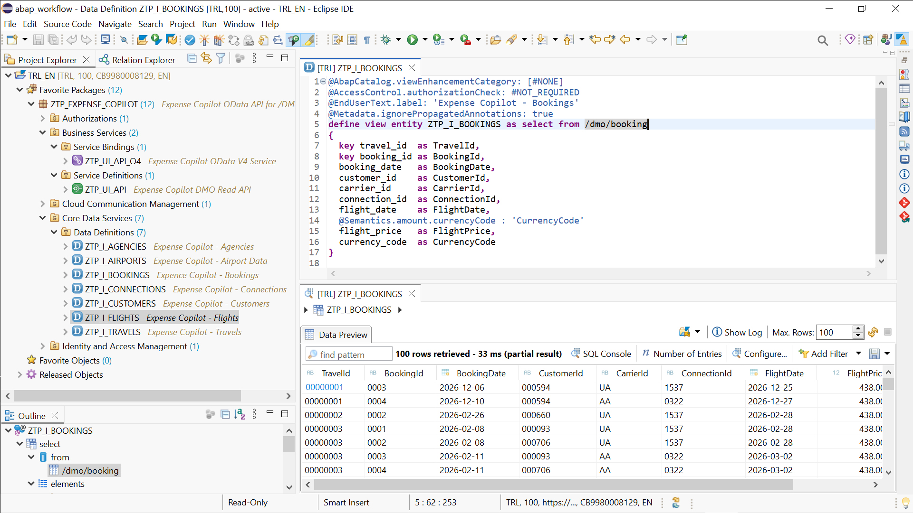
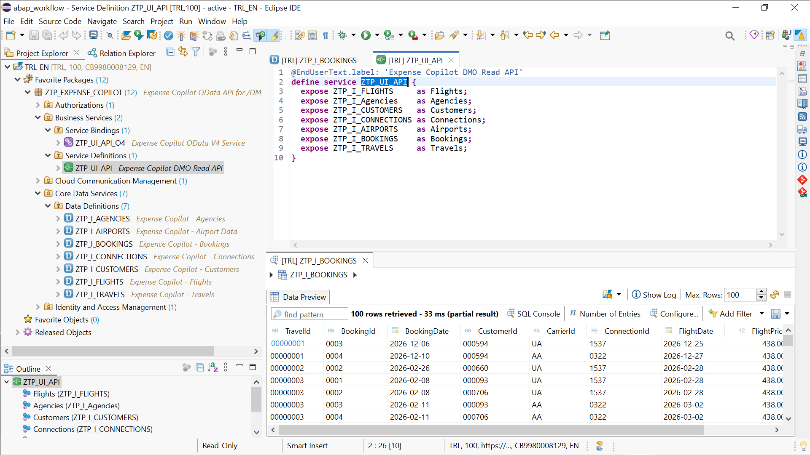
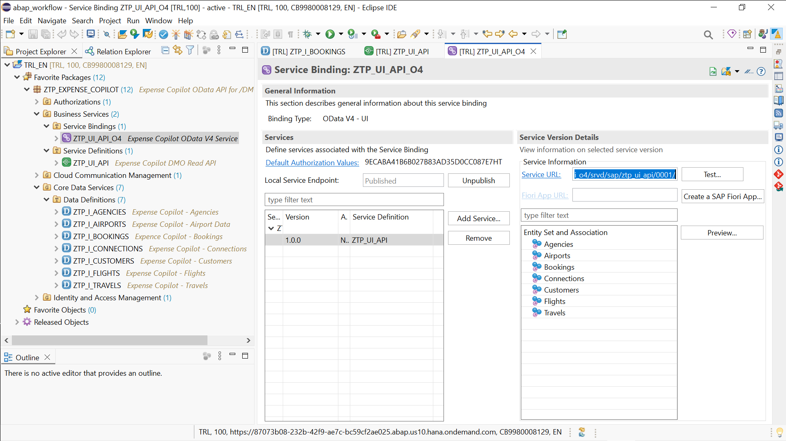

# SAP BTP Travel Expense Intelligence – ABAP Backend

ABAP Cloud data-provider and extraction layer for **SAP BTP Travel Expense Intelligence**, an end-to-end SAP portfolio project built across SAP BTP ABAP, OData V4, SAP CAP, SAP HANA Cloud, Node.js, and SAPUI5 / SAP Fiori.

This repository contains the ABAP artifacts that expose SAP `/DMO/` travel and flight reference data through a dedicated **OData V4 business service**.

The service was used as the **initial SAP data-acquisition layer** for the project. The extracted `/DMO/` dataset was then enriched with airport geographic/GPS information, expanded with generated test records, stored in MySQL during development and testing, and later migrated to SAP HANA Cloud for the main CAP application.

> **Status: ABAP backend complete.**  
> The CDS view entities, Service Definition, and OData V4 Service Binding are implemented, activated, published, and version-controlled with abapGit.

---

## Architecture

```mermaid
flowchart LR
    DMO["SAP /DMO/ Travel & Flight Data"]
    CDS["ABAP CDS View Entities"]
    SD["Service Definition<br/>ZTP_UI_API"]
    SB["OData V4 Service Binding<br/>ZTP_UI_API_O4"]
    ODATA["OData V4 Extraction API"]
    PREP["Data Enrichment &<br/>Synthetic Test Data"]
    MYSQL["MySQL<br/>Development / Testing"]
    HANA["SAP HANA Cloud"]
    CAP["SAP CAP / Node.js"]
    UI["SAPUI5 / SAP Fiori"]

    DMO --> CDS
    CDS --> SD
    SD --> SB
    SB --> ODATA
    ODATA --> PREP
    PREP --> MYSQL
    MYSQL --> HANA
    HANA --> CAP
    CAP --> UI
```



The ABAP OData service is intentionally shown as an **extraction/data-provider layer**, not as a permanent runtime dependency of the main application. This keeps the portfolio application independent from the source extraction service and supports a clean separation between data acquisition and application runtime.

---

## Repository Scope

This repository focuses on the SAP BTP ABAP part of the solution:

- modeling SAP `/DMO/` data with ABAP CDS view entities;
- defining a RAP business service;
- publishing the data through OData V4;
- preserving the ABAP artifacts in Git with abapGit;
- documenting the SAP data-acquisition boundary used by the main Travel Expense Intelligence application.

It does **not** contain the CAP, SAPUI5, receipt-processing, analytics, or SAP HANA Cloud application code. Those components belong to the main [`expense-copilot`](https://github.com/PyCreatorr/expense-copilot) repository.

---

## ABAP Artifacts

### CDS View Entities

Seven custom CDS view entities expose the required `/DMO/` travel and flight data:

| CDS View Entity | Purpose |
|---|---|
| `ZTP_I_FLIGHTS` | Flight schedules, prices, aircraft and seat information |
| `ZTP_I_AGENCIES` | Travel agency master data |
| `ZTP_I_CUSTOMERS` | Customer master data |
| `ZTP_I_CONNECTIONS` | Flight routes, airports, times and distance information |
| `ZTP_I_AIRPORTS` | Airport master data |
| `ZTP_I_BOOKINGS` | Travel booking and booked-flight data |
| `ZTP_I_TRAVELS` | Travel header, dates, totals and status information |

The aliases preserve the OData service contract, including the mixed `Id` / `ID` casing where applicable.

### Service Definition

```text
ZTP_UI_API
```

Description:

```text
Expense Copilot DMO Read API
```

The Service Definition exposes the CDS entities as the following OData entity sets:

| OData Entity Set | CDS View Entity |
|---|---|
| `Flights` | `ZTP_I_FLIGHTS` |
| `Agencies` | `ZTP_I_AGENCIES` |
| `Customers` | `ZTP_I_CUSTOMERS` |
| `Connections` | `ZTP_I_CONNECTIONS` |
| `Airports` | `ZTP_I_AIRPORTS` |
| `Bookings` | `ZTP_I_BOOKINGS` |
| `Travels` | `ZTP_I_TRAVELS` |

### Service Binding

```text
ZTP_UI_API_O4
```

Description:

```text
Expense Copilot OData V4 Service
```

Protocol:

```text
OData V4
```

The binding is published and exposes service version:

```text
0001
```

Generic service URL pattern:

```text
https://<tenant>.abap-web.<region>.hana.ondemand.com/sap/opu/odata4/sap/ztp_ui_api_o4/srvd/sap/ztp_ui_api/0001/
```

Metadata endpoint:

```text
.../0001/$metadata
```

Example entity request:

```text
.../0001/Flights?$top=100&sap-client=100
```

Environment-specific host names and authentication information are intentionally not stored in this repository.

---

## ABAP Development Tools

The following screenshots document the ABAP backend directly in **ABAP Development Tools (ADT) for Eclipse**.

### CDS Data Model

`ZTP_I_BOOKINGS` is implemented as an ABAP CDS View Entity on the SAP `/DMO/` flight reference data. The ADT Data Preview confirms that the CDS entity returns booking data from the underlying SAP reference scenario.



### Service Definition

The service definition `ZTP_UI_API` exposes the seven CDS entities used for the initial data extraction as the OData entity sets `Flights`, `Agencies`, `Customers`, `Connections`, `Airports`, `Bookings`, and `Travels`.



### OData V4 Service Binding

`ZTP_UI_API_O4` publishes the service as an **OData V4 UI service**. The published binding exposes the entity sets `Agencies`, `Airports`, `Bookings`, `Connections`, `Customers`, `Flights`, and `Travels`.



---

## Data Flow into the Main Application

The ABAP service was used to acquire the initial SAP `/DMO/` dataset. The main application does not depend on permanent live access to the trial ABAP system.

```text
SAP /DMO/ data
      ↓
ABAP CDS View Entities
      ↓
ZTP_UI_API
      ↓
ZTP_UI_API_O4
      ↓
OData V4 extraction
      ↓
Airport geo/GPS enrichment
      ↓
Generated test records
      ↓
MySQL development dataset
      ↓
SAP HANA Cloud
      ↓
SAP CAP / Node.js
      ↓
SAPUI5 / SAP Fiori
```

This separation keeps the prepared application dataset independent from the source extraction service and available for continued development, testing, analytics, and application demonstrations.

---

## Technology Stack

### This Repository

- SAP BTP ABAP Environment
- ABAP Development Tools for Eclipse
- ABAP CDS View Entities
- RAP Business Services
- OData V4
- SAP `/DMO/` Flight Reference Scenario
- abapGit
- Git / GitHub

### Main SAP BTP Travel Expense Intelligence Application

- SAP CAP
- Node.js
- SAPUI5 / SAP Fiori with XML Fragments
- MySQL for prepared development/test data
- SAP HANA Cloud for cloud persistence
- Cloud Foundry CLI for deployment and database migration workflows

---

## Repository Structure

The repository is serialized by abapGit, so ABAP development objects are represented by source and metadata files under `src/`.

```text
expense-copilot-abap/
├── .abapgit.xml
├── README.md
└── src/
    ├── package.devc.xml
    ├── ztp_i_agencies.ddls.*
    ├── ztp_i_airports.ddls.*
    ├── ztp_i_bookings.ddls.*
    ├── ztp_i_connections.ddls.*
    ├── ztp_i_customers.ddls.*
    ├── ztp_i_flights.ddls.*
    ├── ztp_i_travels.ddls.*
    ├── ztp_ui_api.srvd.*
    └── ztp_ui_api_o4.srvb.*
```

The additional XML/base-info files are normal abapGit serialization metadata and are required to preserve and recreate the corresponding ABAP repository objects.

---

## Setup in SAP BTP ABAP

### 1. Import with abapGit

Connect this Git repository through the **abapGit Repositories** view in ADT and import it into an ABAP Cloud package.

Project package:

```text
ZTP_EXPENSE_COPILOT
```

### 2. Verify the `/DMO/` reference data

The project expects the SAP `/DMO/` Flight Reference Scenario objects used by the CDS view entities to be available in the target ABAP system.

### 3. Activate the development objects

Activate the seven `ZTP_I_*` CDS view entities and verify them with ADT Data Preview.

### 4. Activate the Service Definition

```text
ZTP_UI_API
```

### 5. Activate and publish the Service Binding

```text
ZTP_UI_API_O4
```

### 6. Verify the OData V4 contract

Open:

```text
.../0001/$metadata
```

and verify the seven entity sets:

```text
Flights
Agencies
Customers
Connections
Airports
Bookings
Travels
```

---

## Repository Purpose

This repository contains the SAP BTP ABAP data-provider layer used by **SAP BTP Travel Expense Intelligence**.

It keeps the ABAP CDS data model, RAP business service, OData V4 exposure, and abapGit serialization together as an independently version-controlled backend component. The repository also documents the SAP data-acquisition boundary between the `/DMO/` reference scenario and the downstream CAP / SAP HANA Cloud application.

---

## Portfolio Focus

This repository demonstrates hands-on experience with:

- ABAP Cloud development in SAP BTP;
- ABAP CDS data modeling;
- SAP `/DMO/` reference data;
- RAP Service Definitions and Service Bindings;
- OData V4 API exposure;
- ABAP-to-external-application data integration;
- abapGit-based source control and transportability;
- integrating an ABAP data provider into a broader CAP / HANA / Fiori architecture.

---

## Backend Completion Status

- [x] Create all seven CDS view entities
- [x] Create `ZTP_UI_API`
- [x] Create `ZTP_UI_API_O4`
- [x] Activate the ABAP artifacts
- [x] Publish the OData V4 service
- [x] Verify the OData V4 endpoint and entity sets
- [x] Version the ABAP package with abapGit
- [x] Version and publish the ABAP backend on GitHub

Optional portfolio enhancements:

- [x] Add selected ADT screenshots
- [x] Add a service-binding / OData metadata screenshot
- [x] Link the main [`expense-copilot`](https://github.com/PyCreatorr/expense-copilot) repository
- [ ] Add the end-to-end application demo

These optional documentation items are not required for the ABAP backend itself to be considered complete.

---

## Main Application

The full end-to-end portfolio project is **SAP BTP Travel Expense Intelligence**.

Main application repository:

[`PyCreatorr/expense-copilot`](https://github.com/PyCreatorr/expense-copilot)

ABAP backend repository:

[`PyCreatorr/expense-copilot-abap`](https://github.com/PyCreatorr/expense-copilot-abap)

The main application contains the CAP / Node.js services, prepared travel dataset, SAP HANA Cloud persistence, receipt-processing and validation logic, cost-efficiency analytics, and SAPUI5 / SAP Fiori user interface.

A dedicated video for this ABAP repository is not required. The end-to-end demo belongs to the main [`expense-copilot`](https://github.com/PyCreatorr/expense-copilot) application and can link back to this repository as the SAP ABAP data-provider layer.

---

## Security

This public repository must not contain:

- passwords;
- access tokens;
- OAuth secrets;
- SAP service keys;
- destination credentials;
- `.env` files containing secrets;
- environment-specific authentication information.

Only source code, abapGit metadata, and non-sensitive documentation should be committed.

---

## License / Usage

This repository is a portfolio and learning project built around SAP's `/DMO/` sample/reference data. SAP product names and sample content remain subject to their respective SAP terms and licenses.
